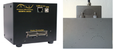
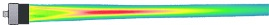
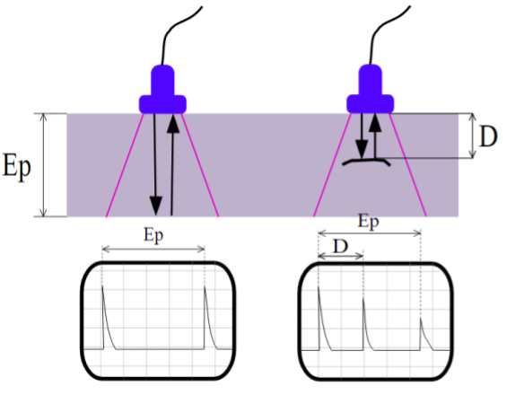
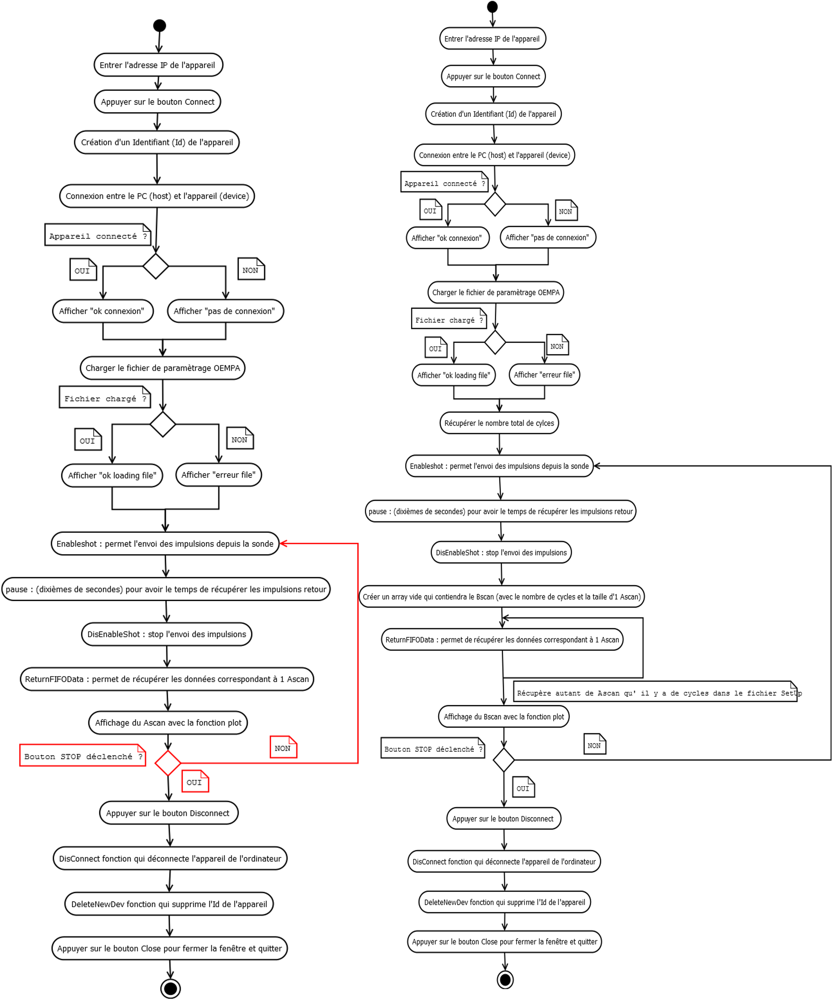
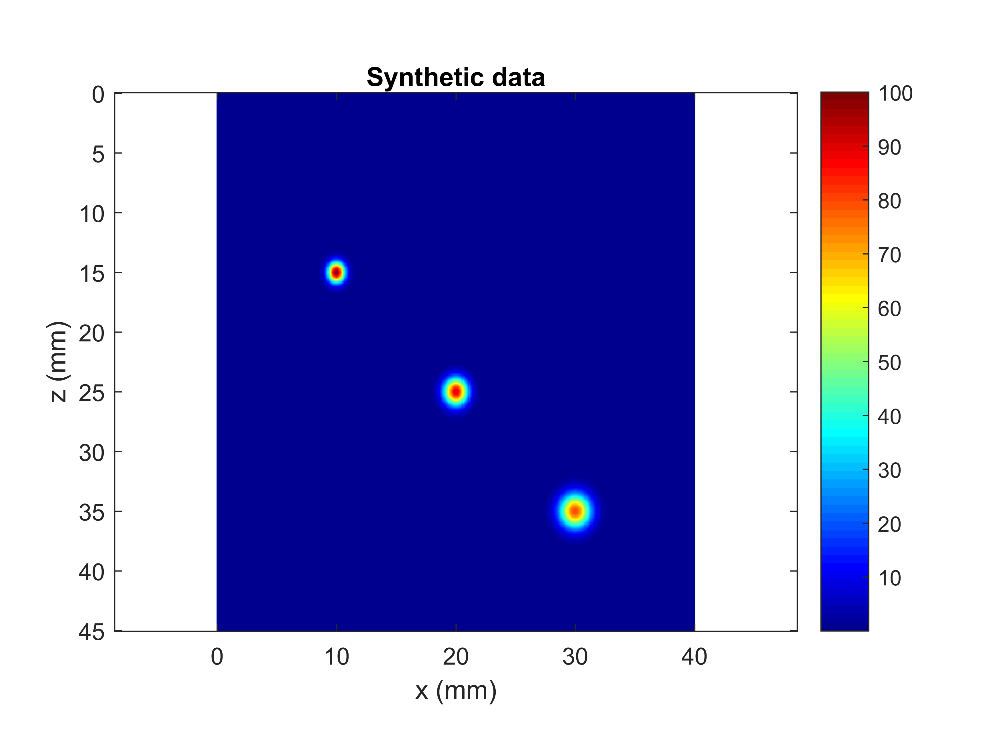
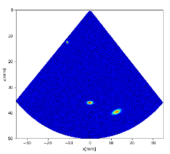
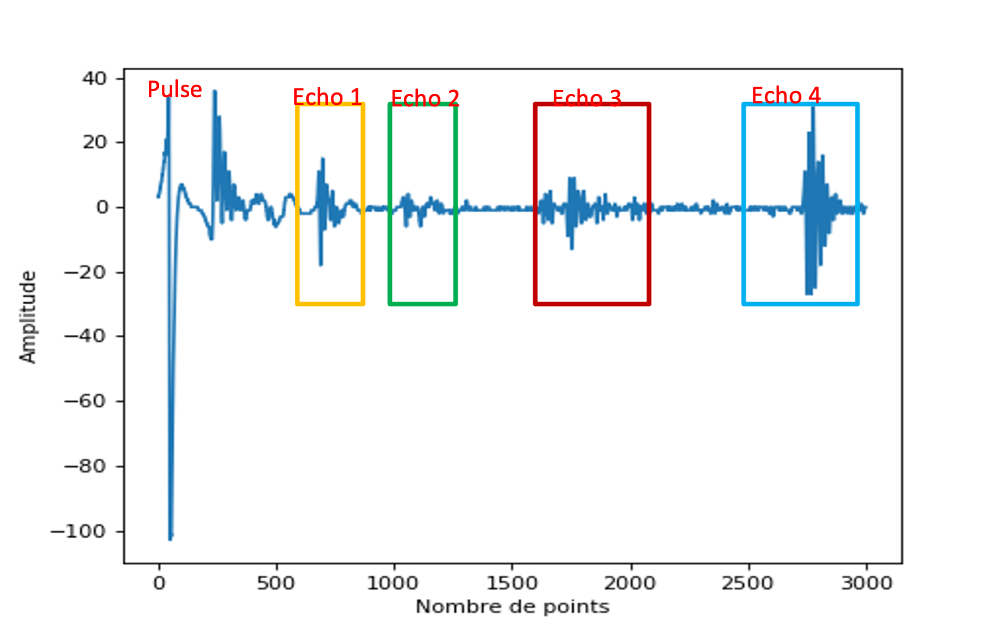
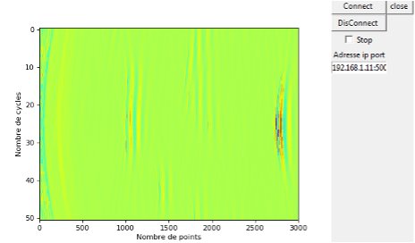

# PFE_CND_ultrasonore

----

## Introduction

This project is part of our last year of engineering degree, in collaboration with DB-SAS company specialized in acoustic module for non destructive control (CND).
The goal is to implement a GUI (Graphic User Interface) for an acoustic wave generator in Python. This device is used to verify if there is an artefact or defect in some material.

You can see what it looks like just below :

The response time of an ultrasonic inspection system depends on several factors.
We have the probe, the type of device and its settings, as well as the properties acoustics of the inspected material. 
The response of phased array probes shown under a beam, depends on the design parameters of the probe that we are going to explain influencing the shape of the signals received and therefore the beam ultrasound. (you can see a representation just below)

Parameters are frequency, size of elements, number of elements, step and opening of transmitter.

Representation of a US beam (in red the high energy areas and in blue and green the lower energy areas)

Ultrasonic devices normally record two basic parameters of an echo: its size (amplitude) and the place in time where it appears in relation to at the zero point (propagation time of the pulse emission). 
Time to propagation, in turn, is generally correlated with distance or depth reflector, based on the propagation speed of the ultrasonic wave from the
controlled material and on the simple relation: Distance = speed x time.
The basic presentation of ultrasonic wave data is the A-scan view which shows the amplitude of the echo and the transit time on a simple grid whose axis
vertical represents amplitude and the horizontal axis represents time.
So we will detect the presence of a defect in the inspected material through the appearance of a echo after the pulse, we can locate this defect in relation to the depth of the material (see below).

If we want a better representation we can use multiple Ascan (pulse response generator) by scanning a surface.
It's what we are going to make to see if there is an artefact on a material.

------

## Project parts 

- In a first part we test the module and think about how to implement our GUI. So we make an UML about how to proceed, you can have a preview below :

- After that we make two views based on synthetic data. So there is a matrix view and a sectorial, you can see them just below :

- Now we can analyze the response to a pulse signal and see the result on if an artefact is present or not. Below a representation of pulse generator echos :

- Finally we have a good solution implement with Tkinter and basic matrix manipulation libraries as numpy and visualization as matplotlib.

To sum up, we make this project into two phases.

1. The prototyping, modeling phase

We produced 3 codes to generate random data. Firstly, a code making it possible to produce an image in rectangular form, then two other codes for the sectorial representation, one of which has reflectors. 
Although we were new to Python, we managed to create these three scripts allowing the implementation of a GUI for each of them. However, not being Python experts certain parts of the code can, it is believed, be optimized to reduce the execution time of various programs.

2. The interfacing phase with the device at our disposal

We first succeeded in establishing the connection between the module and our code, disconnection and reading steps. 
Then, we were able to recover the data from the probe. This step was more difficult, we devoted time and resources to it, we must us network skills and Wireshark app. 
Thus, we were able to modify our graphical interface produced in the previous step to display a fixed A-scan then a mobile A-scan through the use of a loop and finally display a B-scan.

Libs :
- math
- numpy
- scipy
- matplotlib
- tkinter
